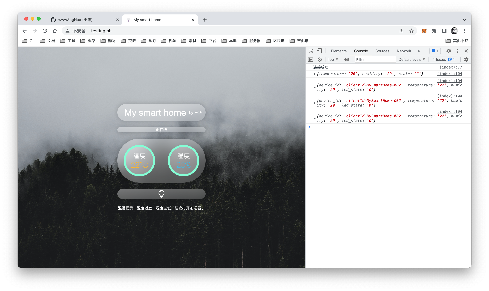

# My smart home
## 介绍
这是一个基于 ESP8266 开发的温湿度检测案例，通过公网 MQTT 服务器发布和接收数据，实现手机电脑远程在线查看温湿度并控制灯泡开关等；材料需要 ESP8266 一块、DHT11 温湿度传感器一个、LED 一个；硬件环境使用 Arduion，其代码在 arduino 文件夹中（注意在库管理中下载对应的类库），其余的代码为 Web 监控页面 ，希望对大家学习物联网有一些帮助，如果觉得有用的话，不妨点个 star 支持一下，谢谢！

## 预览图

## 使用到的类库
| 类库名 | 描述 |
| --- | --- |
| dht11.h | DHT11 温湿度传感器类库（ Arduino ） |
| ESP8266WiFi.h | ESP8266 Wi-Fi 类库（ Arduino ） |
| PubSubClient.h | MQTT 订阅与发布类库（ Arduino ） |
| layui.js | Layui 前端框架（ Web ） |
| mqttws31.js | MQTT 订阅与发布类库（ Web ） |

## 接线
### LED 与 ESP8266
| LED | ESP8266 |
| --- | --- |
| 正极 | D1 |
| 负极 | GND |

### DHT11 温湿度传感器与 ESP8266
| DHT11 | ESP8266 |
| --- | --- |
| VCC | 3.3V |
| DATA | D2 |
| GND | GND |
